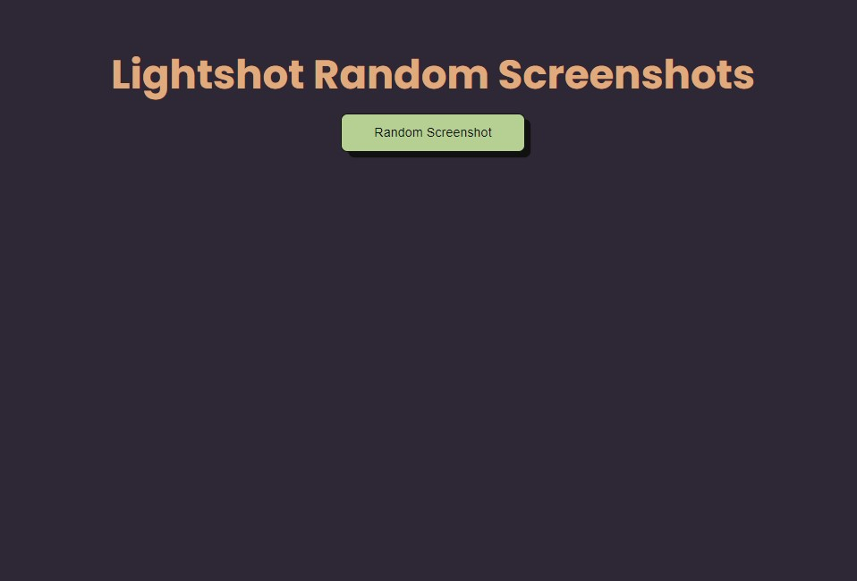
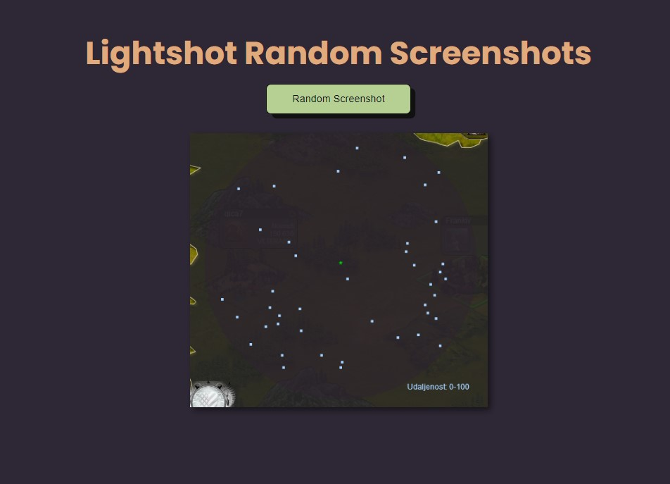

# Lightshot Random Screenshots

This project is a web application that uses Puppeteer to capture random screenshots from the Lightshot website.



## Getting Started

You can run this project on your local machine by following the steps below.



### Prerequisites

To run this project, you will need the following:

- [Node.js](https://nodejs.org/) (v14 or higher)
- [npm](https://www.npmjs.com/) or [Yarn](https://yarnpkg.com/)

### Installation

1. Clone this repository to your local machine or download it as a ZIP file:

```sh
git clone https://github.com/Tolgaycode/Lightshot-random-pictures.git
```

2. Navigate to the project folder:

```sh
cd coingecko-search-input
```

3. Install the required dependencies:

```sh
npm install
```

4. Start the application:

```sh
node app.js
```

The application should now be running at `http://localhost:3000`. Open your browser and visit this address.

## Usage

The application captures a screenshot and displays it on the screen with a button labeled "Random Screenshot." When you click the button, a random screenshot will be taken.

## Live Demo

You can check out the live demo of the project [here]().

## Acknowledgements

- This project uses the [Puppeteer](https://github.com/puppeteer/puppeteer).

## License

This project is licensed under the MIT License. For more information, see the [LICENSE](LICENSE) file.

---

If you have any questions or feedback, feel free to reach out.
